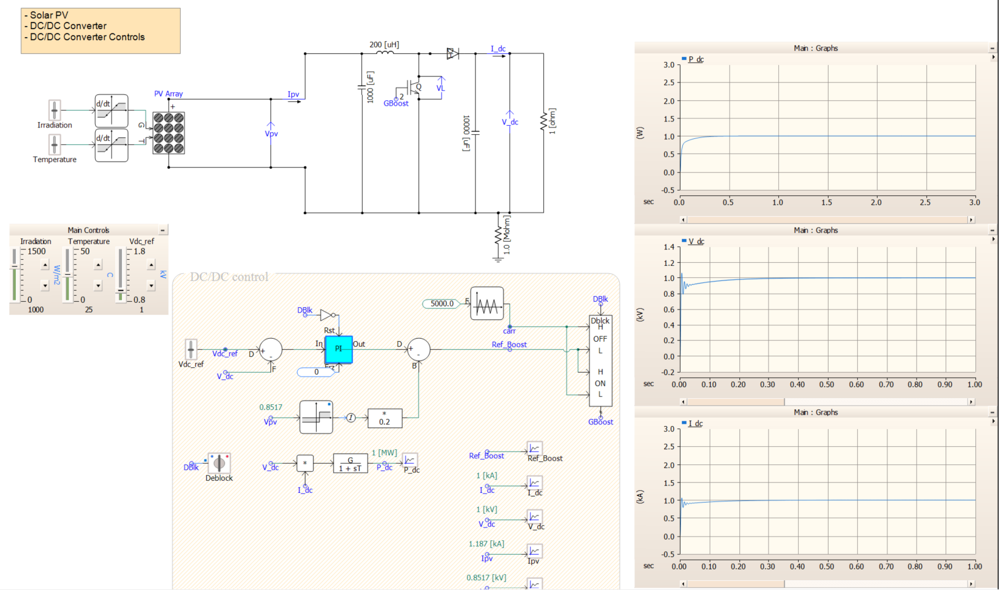

# PSCAD PV Boost Converter Control Model

This repository contains a simple PSCAD model of a photovoltaic (PV) source connected to a DC-DC boost converter.

The model is meant to show a basic idea:

> A PV panel gives a variable DC voltage depending on sunlight and temperature.  
> A boost converter raises this voltage.  
> A PI controller changes the switch duty ratio so that the output DC voltage follows the reference value.

The user can change:

- Irradiance
- Temperature
- DC voltage reference, `Vdc_ref`

The PI controller then generates the duty command, and this duty command is used to create the switching signal for the boost converter switch.



### What this model does

The PV source does not always produce the same voltage and power. When irradiance changes, the available PV power changes. When temperature changes, the PV voltage also changes.

The boost converter is used to regulate the DC output voltage. The controller measures the output DC voltage and compares it with the reference value.

If the measured DC voltage is lower than the reference, the controller increases the duty ratio.

If the measured DC voltage is higher than the reference, the controller reduces the duty ratio.

In simple terms, the controller keeps asking:

Is Vdc equal to Vdc_ref?

If not, it changes the switch duty ratio until the output voltage moves toward the desired value.

### Basic boost converter idea

A boost converter increases a DC voltage by switching an inductor through a power switch.

For an ideal boost converter, the approximate voltage relation is:

$$
V_{dc} = \frac{V_{pv}}{1-D}
$$

where:

* $V_{pv}$ is the PV-side voltage
* $V_{dc}$ is the boosted DC output voltage
* $D$ is the duty ratio of the switch

When the duty ratio increases, the output voltage increases.

This relation is ideal, so the actual PSCAD response can differ because of switching behavior, losses, load changes, and controller dynamics.

### Control method

The control objective is to regulate the DC output voltage.

The voltage error is:

$$
e_v = V_{dc,ref} - V_{dc}
$$

This error is given to a PI controller.

The PI controller produces a duty ratio command:

$$
D = K_p e_v + K_i \int e_v dt
$$

This duty ratio is then compared with a carrier signal to generate the boost switch gate signal.


### Inputs that can be changed

| Input       | Meaning                                      |
| ----------- | -------------------------------------------- |
| Irradiance  | Sunlight level applied to the PV model       |
| Temperature | PV cell or module temperature                |
| `Vdc_ref`   | Desired DC output voltage                    |
| PI gains    | Controller gains used for voltage regulation |

### Signals to observe

Useful signals to plot in PSCAD are:

* PV voltage
* PV current
* PV power
* Output DC voltage
* DC voltage reference
* Voltage error
* Duty ratio
* Switch gate signal

These signals help show whether the converter is tracking the voltage reference properly.

### Expected behavior

When `Vdc_ref` is increased, the controller should increase the duty ratio so that the output DC voltage rises.

When `Vdc_ref` is decreased, the controller should reduce the duty ratio so that the output DC voltage falls.

When irradiance is reduced, the PV source may not have enough available power to maintain the same DC output voltage. In that case, the DC voltage may drop even though the controller is still trying to regulate it.

This is expected because a controller cannot extract more power than what the PV source can provide.

### PI controller tuning

The PI controller gains affect the speed and stability of the voltage response.

If the proportional gain is too small, the voltage response will be slow.

If the proportional gain is too large, the voltage may oscillate.

If the integral gain is too small, the voltage may take a long time to reach the reference.

If the integral gain is too large, the response may overshoot or become oscillatory.

A simple tuning approach is:

1. Start with a small proportional gain.
2. Increase it until the voltage response becomes reasonably fast.
3. Add a small integral gain to remove steady-state error.
4. Check the duty ratio and voltage waveform for oscillations.

### How to run

1. Open the PSCAD project.
2. Set the irradiance value.
3. Set the temperature value.
4. Set the DC voltage reference, `Vdc_ref`.
5. Run the simulation.
6. Plot the DC output voltage and duty ratio.
7. Compare the measured DC voltage with the reference value.

### Repository contents

```text
.
├── README.md
├── image.png
└── PSCAD_Model/
    └── <PSCAD project files>
```

### Purpose of this model

This model is useful for understanding:

* PV behavior under changing irradiance and temperature
* DC-DC boost converter operation
* PI-based DC voltage regulation
* PWM switching signal generation in PSCAD
* Basic closed-loop control of a power electronic converter

### Limitations

This is a simple PV boost converter control model.

It does not include advanced maximum power point tracking, detailed converter protection, grid-connected inverter control, or hardware validation.

The model is mainly intended for learning, demonstration, and basic PSCAD simulation studies.

### Author

Abhiram V. P. Premakumar, Ph.D.
Postdoctoral Research Associate
Department of Electrical Engineering
The University of Texas at Arlington

```
```
