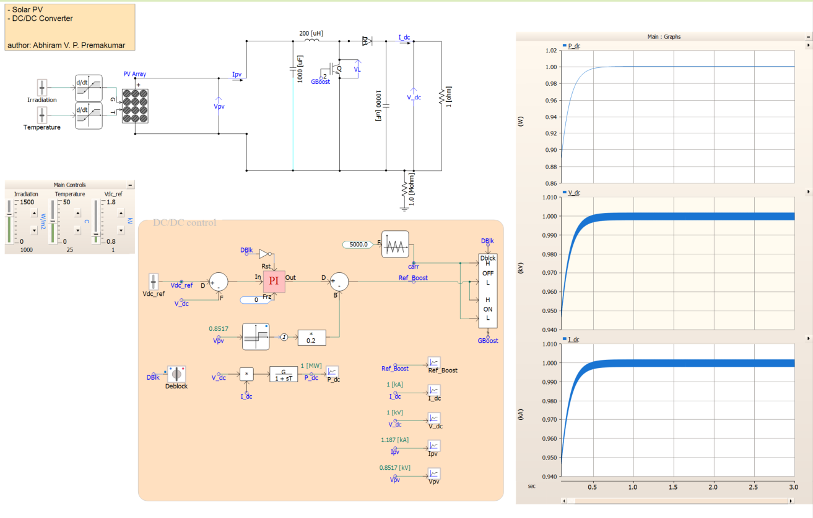

# PSCAD PV Boost Converter

This repository contains a PSCAD model of a photovoltaic source connected to a DC-DC boost converter.

The PV source is defined by irradiance and temperature inputs. The boost converter regulates the DC output voltage by adjusting the switch duty ratio. The measured DC voltage is compared with the reference value, `Vdc_ref`, and the voltage error is passed through a PI controller to generate the duty command.

For an ideal boost converter,

$$
V_{dc} \approx \frac{V_{pv}}{1-D}
$$

where $V_{pv}$ is the PV-side voltage, $V_{dc}$ is the output DC voltage, and $D$ is the duty ratio.

The main parameters are irradiance, temperature, `Vdc_ref`, PI gains, load, and boost converter circuit parameters.

Useful waveforms to observe are PV voltage, PV current, PV power, output DC voltage, reference voltage, duty ratio, and gate signal.

Author: Abhiram V. P. Premakumar
